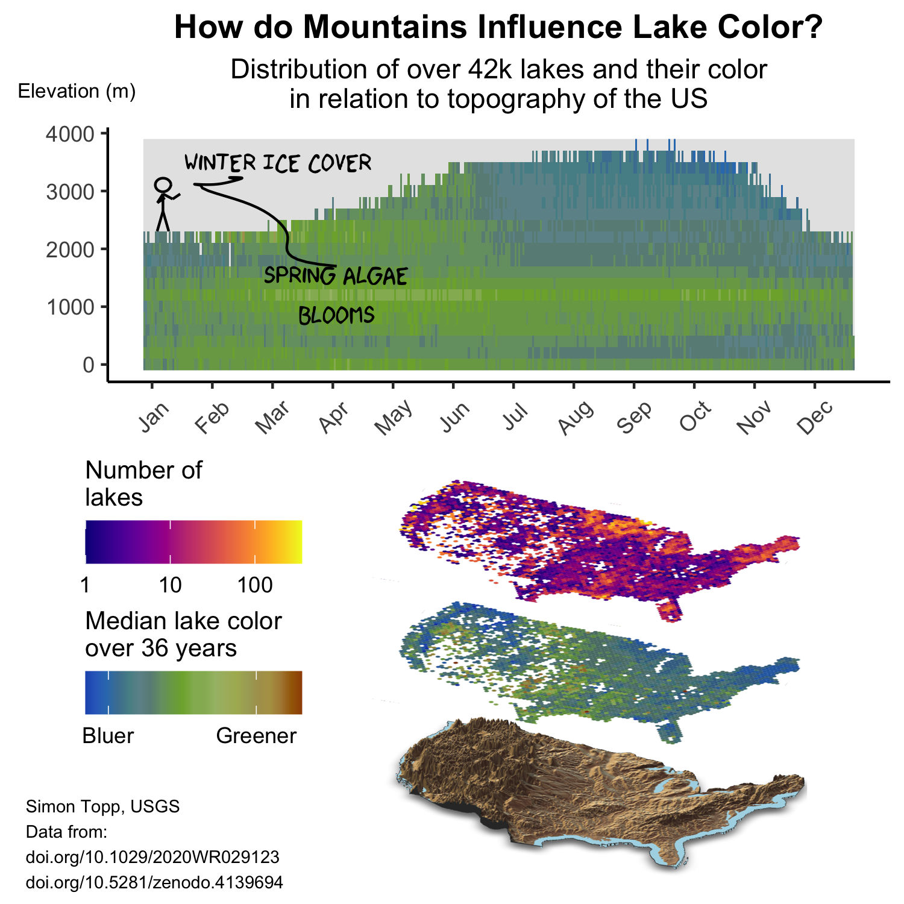

# USGS [#30DayChartChallenge](https://twitter.com/30DayChartChall)

## Chart Info

1.  Overall messaging. How does the chart connect to the day/category? What is the 1-2 sentence takeaway?

Lake color is a key ecological indicator. Drivers of lake color, such as precipitation, ice duration, and land cover, are often correlated to lake elevation. High elevation lakes tend to have fewer nutrient inputs and limited seasonal light availability, leading to lower levels of phytoplankton growth and subsequently bluer colors. Only recently have we been able to examine continental patterns in key ecological indicators such as lake color. In doing so, we're able to better understand how these essential systems are changing in response to long term patterns in climate and land use practices.

1.  The data source and variables used. Where can the data be found? Is it from USGS or elsewhere? Did you do any pre-processing?

All data used can be downloaded with the provided code. Key datasets are 1) [LimnoSat-US](https://doi.org/10.5281/zenodo.4139694), which contains all cloud free Landsat observations of U.S. lakes from the HydroLakes database between 1984 and 2020 and 2) elevation data from USGS.

1.  Tools & libraries used

-   Stacked topography maps: `rayshader` and `elevatr`
-   Stick figure and annotation: `xkcd`
-   Layout: `gridExtra`, `ggplot`, and `cowplot`

