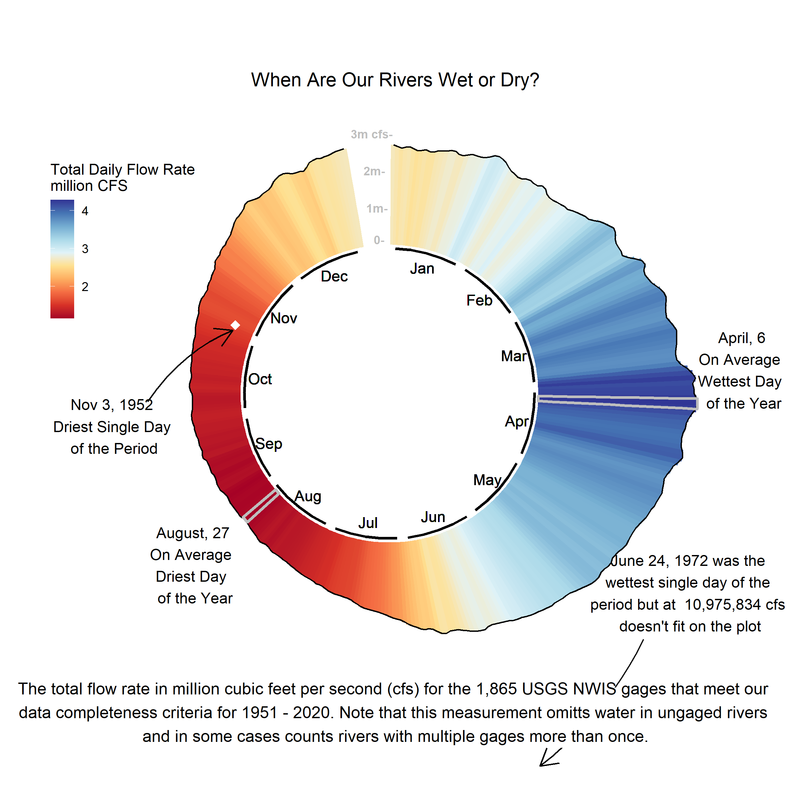
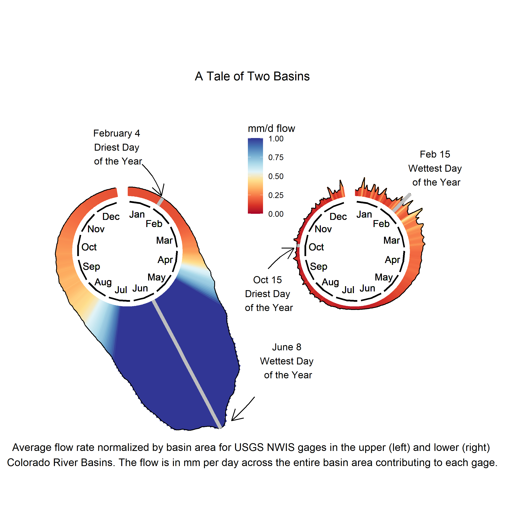
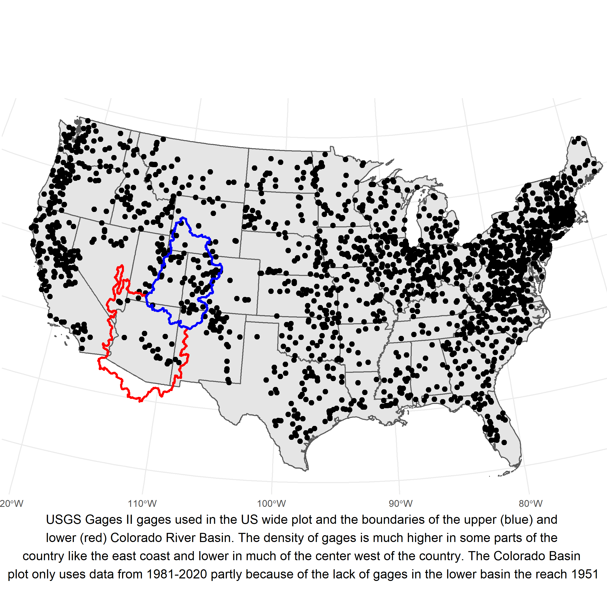

# Circular Distributions of CONUS Wide Streamflow
This sub directory creates a circular plot with the total amount of water passing all gages 2 gages passing auditing requirements for 1951-2020. These figures are created by downloading [NWIS streamflow data](https://waterdata.usgs.gov/nwis/sw) using the 'dataRetrieval' package for R. These scripts summarize that data across years to plot average conditions across all years in a radial bar plot. For the first figure the color and height of each bar represents the total flow of water passing by all of the gages used for that day of the year. The plots are done using the 'ggplot2', 'circular' and 'cowplot' libraries.  

# The Driest and Wettest Day of the Year
Run the script '11_circular_csimeone/scr/plot_the_driest_and_wettest_days.R' to build this plot making sure to set the 'download_new_data' variable to TRUE. 

The amount of flow in rivers in the continental United States varies throughout the year and across the country, but overall where we have gages we see that late winter/early spring months (March - May) tend to have the highest flows and late summer/early fall months tend to have the lowest flows. Extreme events can occur within these long-term ranges, but can also stray outside of them: e.g. extreme low flows in [November 1952](https://pubs.usgs.gov/wsp/1804/report.pdf#:~:text=The%20rare%20occurrence%20of%20a%20succession%20of%20drought-,much%20of%20the%20southern%20half%20of%20the%20Nation.) or extreme high flows in [June 1972](https://pubs.er.usgs.gov/publication/pp924).

# A Tale of 2 Basins
Run the script '11_circular_csimeone/scr/a_tale_of_2_basins.R' to build this plot making sure to set the 'download_new_data' variable to TRUE. To run this script site metadata is required which is available for most sites [here](https://water.usgs.gov/GIS/metadata/usgswrd/XML/gagesII_Sept2011.xml) and for the remaining sites on their NWIS page. 

The Colorado River Basin demonstrates how varied sub-basin flows can be, with wetter conditions driven by snowmelt in the upper part of the basin, and drier conditions influenced more by monsoonal rains in the lower part of the basin. The USGS is currently working to better understand hydrological drought dynamics across the country and recently hosted a stakeholder listening session on [streamflow drought](https://www.drought.gov/webinars/drought-prediction-focus-streamflow-end-user-listening-session). Future listening sessions aimed at engaging a wide range of stakeholders will cover [groundwater drought](https://www.drought.gov/events/drought-prediction-focus-groundwater-end-user-listening-session), water use, ecosystems, and drought prediction.

# Plot of Gage and Basin Locations
Run the script '11_circular_csimeone/scr/plot_gages.R' to make this map of gage and basin locations. Data for plotting the gages can be found [here](https://www.sciencebase.gov/catalog/item/59692a64e4b0d1f9f05fbd39) and data for plotting the basins can be found [here](https://apps.nationalmap.gov/downloader/#/)

Gages with throrough historical records back to 1951 span across the country, but there are more in some regions than in other. 
