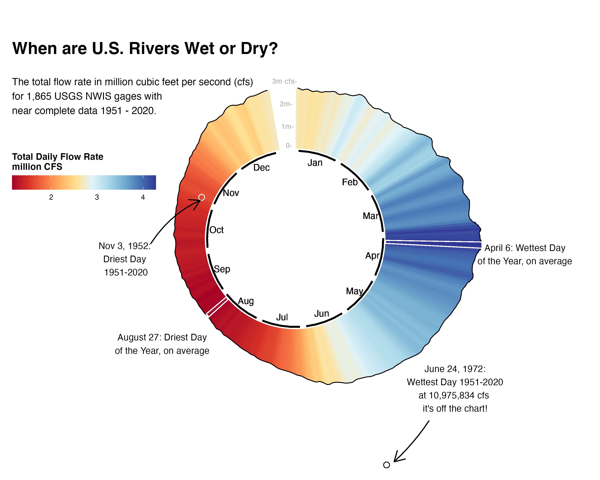
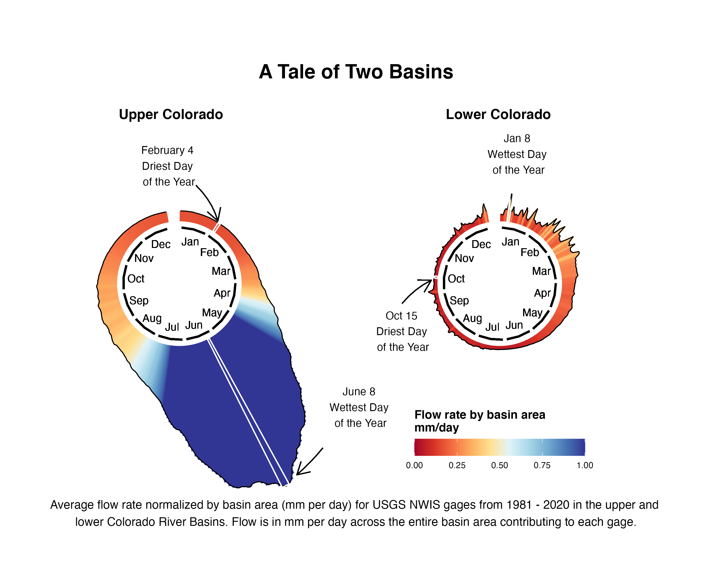

# Circular Distributions of CONUS Wide Streamflow
This sub directory creates a circular plot with the total amount of water passing all gages 2 gages passing auditing requirements for 1950-2020. 

# Post 1

The amount of flow in rivers in the continental United States varies through the year and across the country, but overall where we have gages we see that late winter/early spring months (March - May) are tend to have the highest flows and late summer/early fall months tend to have the lowest flows. Extreme events can occur during these normally high or low periods or can occur outside of them like the extreme low flows in [November 1952](https://pubs.usgs.gov/wsp/1804/report.pdf#:~:text=The%20rare%20occurrence%20of%20a%20succession%20of%20drought-,much%20of%20the%20southern%20half%20of%20the%20Nation.) or extreme high flows in [June 1972](https://pubs.er.usgs.gov/publication/pp924).

# Follow Up Post 2

The Colorado River Basin demonstrates how varied different basins or parts of a basin can be, with wetter snowmelt dominated hydrology in the upper part of the basin, and drier hydrology influenced more by monsoonal conditions in the lower part of the basin. The USGS is currently working hard to better understand hydrological drought across the country and how it varies across the country and recently hosted a stakeholder listening session on [streamflow drought](https://www.drought.gov/webinars/drought-prediction-focus-streamflow-end-user-listening-session) and will be hosting future listening sessions for stakeholders across the country for those interested in hydrological drought topics such as [groundwater drought](https://www.drought.gov/events/drought-prediction-focus-groundwater-end-user-listening-session).
