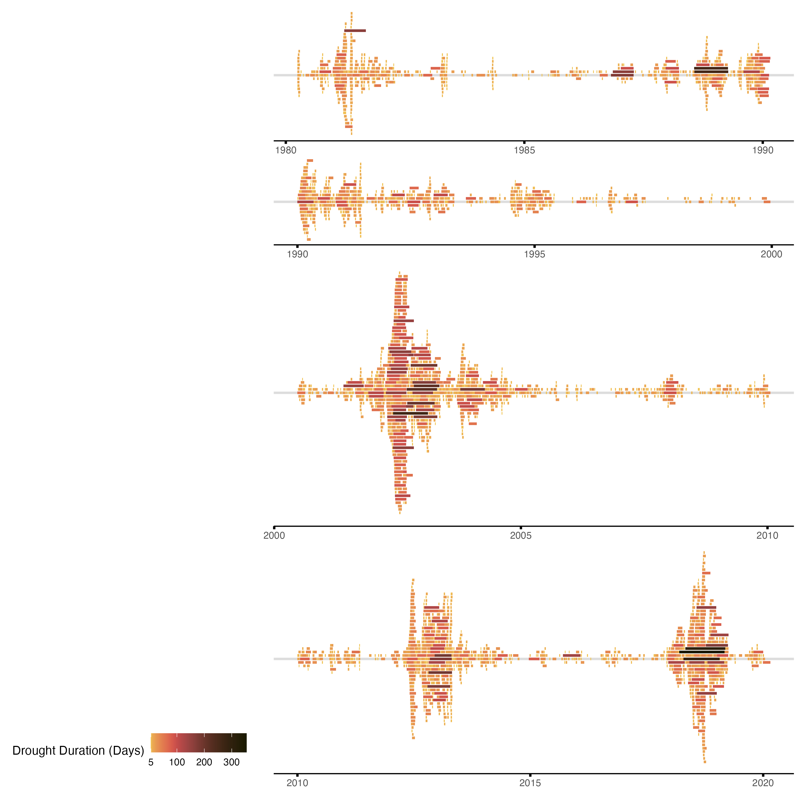
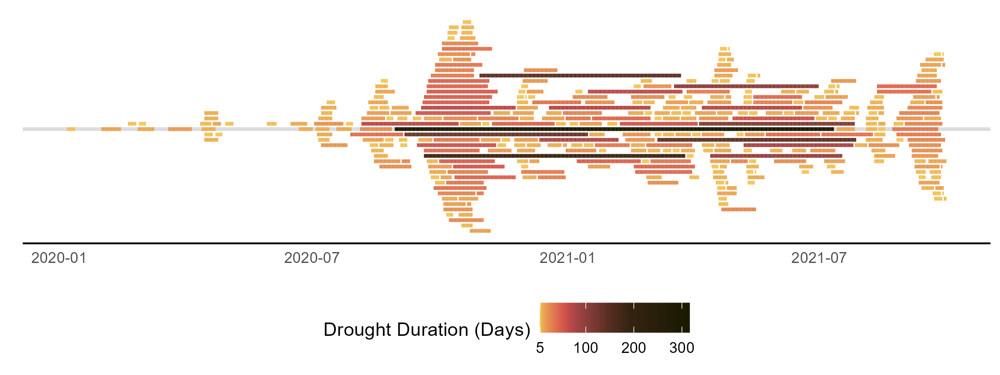

# Occurence of Streamflow Drought Events in the Upper Colorado River

This data visualization shows the occurence of streamflow drought events observed at USGS streamgages in the Upper Colorado River Basin. For the purposes of this visualization, a streamflow drought event is defined as the time period when streamflow drops below the 5th percentile of streamflows that have been observed on that date (utilizing a 30-day moving window). The source data for this plot is daily streamflow records downloaded from  [USGS NWIS](https://waterdata.usgs.gov/nwis/sw). 

## Data Preparation

To prepare the plot data file the following processing steps were performed:

 - Audit streamflow records to filter all available data to only data from streamgages where records between 1980 and 2020 have 5% or less missing data.
 - Convert daily streamflow values to daily streamflow percentile values by comparing each daily observation to the historical record of observation on that day, and the 15 days before/after using a Weibull plotting position. For handling days with zero streamflow measured, values are ranked by the number of previous zero flow days and the length of zero flow period. 
 - Delineate the start, end, and duration of drought events by defining a minimum drought event duration of 5 days and pooling separate individual events separated by less than 5 days.
 
## Making of the visualization

This visualization uses the `targets` R package as a workflow tool. Install it with `install.packages('targets')`. 

There are a few additional packages you may need if you do not have them installed already. To install all, run:

```
install.packages(c("tidyverse", "lubridate", "scico", "paletteer", "BAMMtools", "scales", "ggforce", "showtext", "cowplot"))
```

Then you can build the base visualization images (some annotation is not included in the output of the workflow) with one command by setting your directory to this file's location (e.g., `setwd('19_shamshaw')`) and running:

```
targets::tar_make()
```

The pipeline will automatically download the data needed. In total, the pipeline should take about 5-10 minutes to download the data, process it, and build the visuals.


# 30 Day Chart Challenge contribution

### 2022 Time Series: Global Change category

1. Are occurrences of streamflow drought events becoming more common? To answer we plot streamflow drought event periods for 122 river gages in the Upper Colorado River basin for day 19 #30DayChartChallenge, Global Change by Scott Hamshaw 



*Alt text: A time series of streamflow drought events occurring across 122 stream gages in the Upper Colorado River basin for each decade from 1980 to 2020*

2. At the end of the 2010 decade few streamgages were considered in streamflow drought, but more recently, starting in the summer of 2020 we saw many locations have streamflow decline into drought conditions



*Alt text: A time series of streamflow drought events occurring across 122 stream gages in the Upper Colorado River basinfor 2020 through October 1, 2021*

3. In these charts, occurrences of streamflow drought events occurring across 122 different streamgages in the Upper Colorado River Basin are arranged chronologically. The wider the plot grows, the greater number of streamflow drought events are happening simultaneously.

4. Drought conditions can be determined using many different methods. The method used in this analysis is to define a streamflow drought event as the period when streamflow is below the 5th percentile of flows that have been observed on that date.

5. This variable threshold method of determining streamflow drought events can detect periods of abnormally low streamflow at any time of the year -– important information for water resource managers. 

6. @USGS is currently working to better understand streamflow drought conditions throughout the Colorado River Basin in order to build early warning capabilities.  
