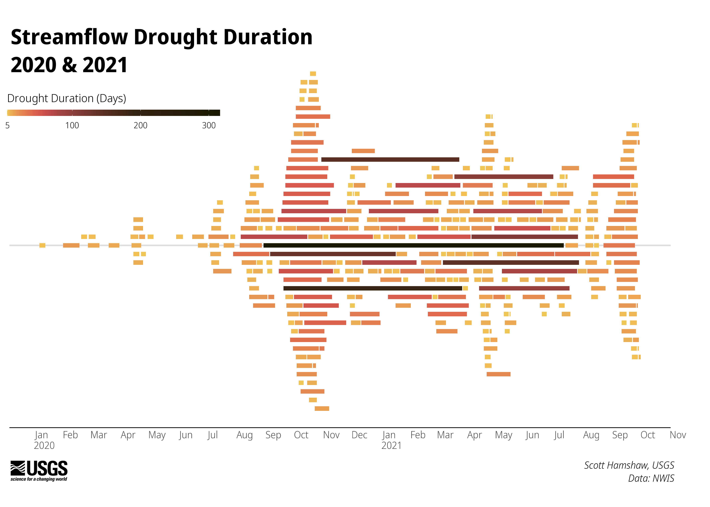

# Occurence of Streamflow Drought Events in the Upper Colorado River

Add some text here on data set and R packages used 

Run the targets pipeline to build the base visualizations. 

# Messaging

## Tweet 1

Are occurrences of streamflow drought events becoming more common? To answer we plot streamflow drought event periods for 122 river gages in the Upper Colorado River basin for day 19 #30DayChartChallenge, Global Change by Scott Hamshaw 

Alt text: A time series of streamflow drought events occurring across 122 stream gages in the Upper Colorado River basin for each decade from 1980 to 2020

## Tweet 2

At the end of the 2010 decade few streamgages were considered in streamflow drought, but more recently, starting in the summer of 2020 we saw many locations have streamflow decline into drought conditions

Alt text: A time series of streamflow drought events occurring across 122 stream gages in the Upper Colorado River basinfor 2020 through October 1, 2021

## Tweet 3

In these charts, occurrences of streamflow drought events occurring across 122 different streamgages in the Upper Colorado River Basin are arranged chronologically. The wider the plot grows, the greater number of streamflow drought events are happening simultaneously. (Could include map here?)

## Tweet 4

Drought conditions can be determined using many different methods. The method used in this analysis is to define a streamflow drought event as the period when streamflow is below the 5th percentile of flows that have been observed on that date.

## Tweet 5

This variable threshold method of determining streamflow drought events can detect periods of abnormally low streamflow at any time of the year -– important information for water resource managers. 

## Tweet 6

@USGS is currently working to better understand streamflow drought conditions throughout the Colorado River Basin in order to build early warning capabilities.  
